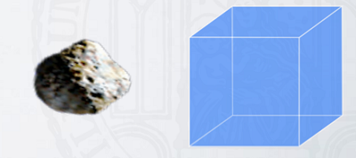

# Migration

***

<h3> <strong> <u>  Introduction </u></strong> </h3>

:::::{div} full-width
::::{grid} 2

:::{grid-item}
:columns: 7

Intro paragraph

:::

:::{grid-item}
:columns: 5

**Plan**

- [**Dust Dynamics within PPD**](content:references:Title1) 
    - Subsection

<br>

- **Summary**

:::

::::
:::::


:::::::{div} full-width

::::::{grid} 2

:::::{grid-item-card}
:class-header: bg-light
:columns: 9

**Notes**
^^^
::::{grid} 2
:::{grid-item}

```{admonition} To Do
:class: note, dropdown

- Think about coherent plan
- Implement

```

:::

:::{grid-item}

```{admonition} Colaboration
:class: tip, dropdown

Presentation

```
:::
::::
:::::


:::::{grid-item-card}
:class-header: bg-light
:columns: 3
**Page**
^^^

- Status: 
  
- Reviewed: &#x274C;
       
- Updated: 15/02/2023
   
::::::
:::::::

(content:references:Title1)=
## Dust Dynamics within PPD

***

- {cite:p}`Weidenschilling1977`: drag force in solar nebula, collisions, size fractionation of bodies, velocities up to 104 cm/s (m sized objects).

***

We will speak about **dust transport** within PPD

### <strong> &#x2023; <u> Drag Force </u></strong>

Dust:gas interaction

- Epstein regime ...
- Stoke drag regime

#### <strong> Stock number </strong>

```{note}

Insert formula : St = \Omega _{K} \tau _{S}

```

:::::{div} full-width
::::{grid} 3 

:::{grid-item}
:columns: 4 

##### <strong> St &#60; 1 </strong>

<figure id="transition-img">
<div class="images-Stoke">


</div>
<figcaption>What to say</figcaption>
</figure>

- t<sub>stop</sub> < t<sub>orb</sub>

Explanation

:::
    
:::{grid-item}
:columns: 4 

#### <strong> &#x2023; &#x2023; St ~ 1 </strong>

<figure id="transition-img">
<div class="images-Stoke">


</div>
<figcaption>What to say</figcaption>
</figure>

- t<sub>stop</sub> ~ t<sub>orb</sub>

Explanation

:::

:::{grid-item}
:columns: 4    

#### <strong> &#x2023; &#x2023; St &#62; 1 </strong>

<figure id="transition-img">
<div class="images-Stoke">


</div>
<figcaption>What to say</figcaption>
</figure>

- t<sub>stop</sub> > t<sub>orb</sub>

Explanation

:::

::::

:::::


### <strong> &#x2023; <u> Radial Drift </u></strong>

As a result of the aformentioned drag force ...

An orbiting parcel of gas is in a force balance between the following  
- Gravitational, 
- Centrifugal, 
- Pressure. 

The pressure gradient is pointing outwards, because densities and temperatures are higher in the inner disk. As a result, **sub-Keplerian** gas velocities.

#### Relative Velocities

:::::{div} full-width
::::{grid} 2

:::{grid-item}

Explanation

<br>
<br>

- Different sizes, different speeds ...

<br>
<br>

First sticking, growth mechanism (link to the following chapters)

<br>
<br>

blabla

:::

:::{grid-item}

<iframe width="100%" height="100%" src="https://www.youtube.com/embed/KsBAVsKBZQk" title="YouTube video player" frameborder="0" allow="accelerometer; autoplay; clipboard-write; encrypted-media; gyroscope; picture-in-picture; web-share" allowfullscreen></iframe>

:::
::::
:::::


```{image} Docs/Relative-velocities-W1993.png

```

- {cite:p}`Weidenschilling1993`: Book chapter (evolution of solid particles in solar nebula), bodies ≤ km: motion dominated by gas drag, planetesimals probably formed by coagulation of grain aggregates, collisions caused by differential settling, turbulence, gas drag, orbital decay, sticking mechanisms poorly understood, growth aided by concentration of larger bodies toward central plane, gravitational instability unlikely for particle layer formed by settling (turbulence prevents reaching critical density (independent of particle size).


### <strong> &#x2023; <u> Dust Trapping </u></strong>


### <strong> &#x2023; <u> Radial mixing and meridional flows </u></strong>


### <strong> &#x2023; <u> Vertical mixing & settling </u></strong>


## Dust Dynamics in Plasma


- {cite:p}`Chai2018` Dynamics of non-spherical, fractal dust grains

"Because dust particles are not spherical they show different dynamics from spherical particles in a plasma environment namely, they align in the direction perpendicular to the force equilibrium line, rotate about their alignment axis due to the interaction between the dipole moment and the surrounding electric field, and show vortex motion while maintaining their alignment and rotation when they are exposed to a nonconservative drag force"

## Processes around the snowline

### Sublimation

- {cite:p}`Saito2011`: Modelling (infall of icy dust aggregates by gas drag => temperature increase => H2O sublimation inside snow line => ejection of silicate cores (slower infall than icy dust => accumulation => gravitational instability)

### Condensation

- {cite:p}`Ros2013`: numerical modeling, condensation (around snow line) can support/continue growth where dust coagulation is frustrated by barriers, growth from mm to decimeter scale in 1000 years, water transport over radial ice line dominant (over atmospheric ice line negligible), model ignores sticking/fragmenting particle collisions


## Aggregate formation

- {cite:p}`Kataoka2013b`: analytical analysis of static compression (disk gas pressure and self gravity), coagulation forms fluffy grains, problem: collisions don’t compress them enough to from compact planetesimals, gas and self gravity can overcome this


## Results from dust dynamics

- {cite:p}`Gail2004`: Modelling (evolution of main dust components, chemical composition, Mg-Fe-silicates, Mg-silicates & Fe, advection-diffusion, radial mixing), resulting mineral mixtures are in rough agreement with matrix material of meteorites/cometary nuclei.

```{note}

Good to make link with previous chapter (building block)

```
    

## Dust migration at the inner rim interface

- {cite:p}`Kelling2013`: Illumination of inner edge of disk creates gas flow, local mass flow rates up to Ṁ = 10−5M⊙ yr−1.