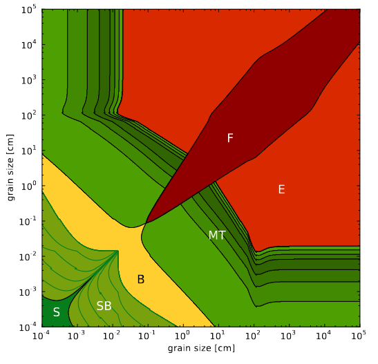

# Planet formation

:::::{div} full-width
::::{grid} 2

:::{grid-item}

<h3> from a cloud of µm dust grains ... </h3>

<video src="../_static/video/ssc2004-08v2_h264_vga.mov" width="100%" height="" controls>
  Your browser does not support the video tag.
</video>

:::

:::{grid-item}

<h3> ... to Solar and planetary systems </h3>

<video src="../_static/video/ssc2004-08v3_h264_vga.mov" width="100%" height="" controls>
  Your browser does not support the video tag.
</video>
 
:::
::::


Our current understanding of planet formation is rudimentary at best, and this lack of knowledge is compounded at the very initial stages. We know that 
- **Protoplanetary disks**

We don't know about

- Overcoming the **Bouncing barrier** around the cm scale


:::::


***

:::::{div} full-width
::::{grid} 3
:::{grid-item}
:columns: 5
**Plan**
- **Introduction**

:::
:::{grid-item}
:columns: 4

**Key litterature**

- cite Gundlach - formation of comets (caveats: rely extensively on existence of pebbles, for which only indirect evidence exist - `ref 3` )

<br>
<br>

**Links**

:::
:::{grid-item-card}
:class-header: bg-light
:columns: 3

Teaching ✏️
^^^

<p class="emphase">Planet formation</p>


<br>

**Link**: 


[](https://deugz.github.io/nb-teaching/_build/html/Bitesize/Astronomy/Planet_formation_bottom-top/Planet_formation_bottom-top.html) 

<br>

[](https://deugz.github.io/nb-teaching/_build/html/Bitesize/Astronomy/Planet_formation_top-bottom/Planet_formation_top-bottom.html) 

<br>

+++
**Audience**: <span class="hovertext" data-hover=""> Insert Audience</span>

:::

::::

:::::

## Setting up the scene

### The Interstellar medium

ISM, multitude of environments with various conditions, temperature, density, radiation fields etc.

#### Molecular clouds

```{note}

may be no need to go into title, just quick paragraph to explain the preliminary stage, refering to the teaching sections relating to those environments

- may be insert a JS picture display to show different molecular clouds where star formation is embeded in the following paragraph and do this as an intro paragraph

```

### Star formation


::::{grid} 2 

:::{grid-item}

```{figure} Docs/weic2219a.jpg
---
name: Experiment
width: 600px
---
The Protostar within L1527 source: [NASA APOD](https://apod.nasa.gov/apod/ap221118.html) *2022 November 18 *
```

:::

:::{grid-item}

In a nutshell [...]

```{note}

- Insert Molecular cloud picture

```

`protostellar disk` to `protoplanetary disk` in 10<sup>4</sup> years (`ref 4 - 5`)
This process involve high temperature but while material is accreted by the star the disk mass and temperature decrease. 


:::

::::


### Protoplanetary Disks

Evolution of PPD is dominated by:
- Ongoing `accretion` of material onto the star
- `photoevaporation`
- `dust agglomeration`
- `dynamical interaction` with stellar or galactic environment

#### Properties


##### Mass

PPD mass can be constrained by **ALMA measurments** using different methods

**Example**:
- Mass of solids in mm-sized dust grain can be estimated from the `mm flux density` combined with **assumptions** about `optical depth`, `dust opacity` and `disk temperature` (cf ref `12-17`).
- Other methods uses the amplitude and wavelength of the `gravitational instability wiggle` (`ref 18` - **?**)

the mass of PPDs is dominated by gasses (H<sub>2</sub> and He) 

- dust to gas ratio is typically 1:100 - to check for ref

##### Disk component orbital velocity

Orbital gas velocity in PPDs is reduced below the `Keplerian speed` because the negative radial `gas-pressure` gradient (pushing outwards) counteracts the `gravitational pull` of the stars.
Solid materials are not pressure supported and as a result, dust particles should orbit the stars at Keplerian velocity but because they experience a `headwind` from the slower-rotating gas, a `drag force` acts on the particles, slowing them down.
- `Epstein drag law` for particles that are **smaller** than the `mean free path of the gas`
- `Stokes drag law` for particles **bigger** than the `mean free path of the gas`

Different `flow regimes`.


```{note}

What is meant by the **mean free path of the gas**

[Wikipedia](https://en.wikipedia.org/wiki/Mean_free_path)

```

The gas drag acting on dust particles is best described by the **`stopping time`**:

```{admonition} latex formatting

\tau _{f} = \left\{\begin{matrix}

\frac{R\: \rho _{p}}{c_{S}\: \rho _{g}} \: \: \:  (a) 

\\ 
\\

\frac{4\:\rho _{p} \:R^{2}}{9\: c_{S}\: \rho _{g}\: \lambda } \: \: (b) 

\end{matrix}\right.

- **Check how to implement directly into the text** and formatting options available

```

```{figure} Docs/Equation/Stoping_time.svg
---
name: Experiment
width: 200px
---
(a) correspond to Epstein regime, (b) Stokes regime
```

- R particle radius
- pp particle density
- pg gas density
- Cs gas sound speed
 - &lambda; mean free path
 
A common measure of particle sizes in protoplanetary disks is the `Stokes number`, defined as:

```{figure} Docs/Equation/Stokes_number.svg
---
name: Experiment
width: 200px
---
Omega is Keplerian frequency (?)
```

```{note}

St = \Omega \:  \tau _{f} 

```

Particles with the same Stokes number behave aerodynamically similar. For a fixed value of the mass density of the dust particle, the Stokes number represent the **particle size**. Hence, particles of different sizes obtain different speeds at the same `heliocentric distances`, leading to different `relative velocities` among the solid particles population and hence different collision speeds.  


##### Snowline

###### Ice in PPD

**Mekler and Podolak Model**: 
- {cite:p}`Mekler1994` 
- {cite:p}`Podolak1997`


###### Where is the snow-line

For water ice, the critical condensation temperature is between 145K (ref 24) and 170K (ref 25) dependant on the **assumed local pressure**

However, snow-line location of different ice species can vary due to several processes in the disk (`ref 26 - 28`)

## Growth mechanism

When Temperature inside PPD has decreased sub-micrometer to micrometer sized solid particles start to condense
- {cite:p}`Li2020`

### Coagulation of dust and ice particles

:::::{div} full-width
::::{grid} 2

:::{grid-item}

**Nomenclature** (from `ref 2`)
- `Grains` (dust or ice) or sub &micro;m in size and homogeneous in composition (1 material) - (**Not really accurate is it ?**)
- `Agglomerates` are grains that can be heterogeneous in composition
- `Pebbles` mm to decimeter sized porous agglomerates (up to growth barrier when hit and stick regime stops)

:::

:::{grid-item}

```{figure} Docs/Early_growth_Me.PNG
---
name: Bouncing_lab
width: 800px
---
source: *Formation of comets* Blum 2022 - to reproduce better
```

:::

::::

:::::


#### The Bouncing Barrier


#### Formation of planetesimals from pebbles 

via `streaming instability` and subsequent `gravitational collapse`

##### Dust settling

````{margin}

```{figure} Docs/growthB_I.PNG
---
name: Bouncing_lab
width: 800px
---
source: *Formation of comets* Blum 2022 - to reproduce better
```

````

##### Streaming Instability

````{margin}

```{figure} Docs/growthB_II.PNG
---
name: Bouncing_lab
width: 800px
---
source: *Formation of comets* Blum 2022 - to reproduce better
```

````


##### Gravitational collapse

````{margin}

```{figure} Docs/growthB_III.PNG
---
name: Bouncing_lab
width: 800px
---
source: *Formation of comets* Blum 2022 - to reproduce better
```

````


#### Evolutionary alteration

Leads to 3 different categories of evolved planetesimals
- `Icy pebble piles`
- `Icy rubble / pebble piles`
- `Non icy rubble piles`
They can be further subdivided depending on the evolution process


## Bouncing barrier

### Growth mechanism

Particles are coupled to the gas (Orbiting at Keplerian speed) and this is what drives the relative speed of &micro;m dust grains (ie more or less head wind relative to their size). Dust orbits the protostar at very high velocities but the relative velocities between particles in collisions can be very slow (few cm or a few mm per second). At such velocities a “bouncing barrier” exists {cite:p}`Zsom2010`. Up to mm sizes the sticking is dominated by <span class="hovertext" data-hover="Description">Van der Waals type forces</span>, leading to the formation of fluffy aggregates. Past the km scale, gravity dominates {cite:p}`Gutler2010`.


::::::{div} full-width
:::::{grid} 2

::::{grid-item-card}
:class-header: bg-light
:columns: 6
**Experiment**
^^^

```{figure} Docs/Bouncing_lab.PNG
---
name: Bouncing_lab
width: 500px
---
source: 
```


::::

::::{grid-item-card}
:class-header: bg-light
:columns: 6
**Model**
^^^

:::{figure-md} markdown-fig


This is a caption in **Markdown**!
:::


::::
:::::
::::::


Those two figures comes from {cite:p}`Testi2014`


**models of grain growth** 

Alongside the size of the colliding particles the relative velocity is also important


