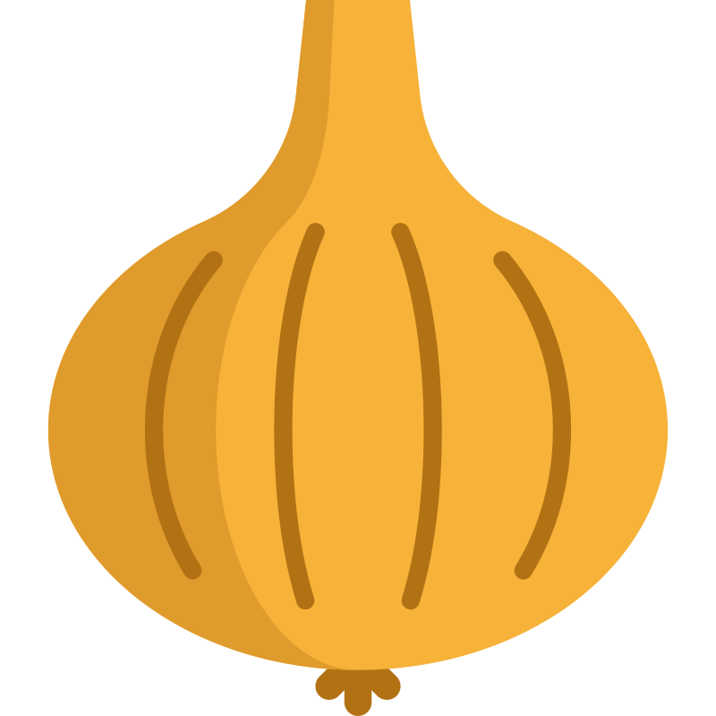

# Planet formation

:::::{div} full-width
::::{grid} 3

:::{grid-item}
:columns: 5

<p class="emphase">from a cloud of µm dust grains ...</p>

<video src="../../_static/video/ssc2004-08v2_h264_vga.mov" width="100%" height="" controls>
  Your browser does not support the video tag.
</video>

:::

:::{grid-item}
:columns: 2

<br>
<br>
<br>
<br>

```{image} Docs/Question.png
```

:::


:::{grid-item}
:columns: 5

<p class="emphase">... to Solar and planetary systems </p>

<video src="../../_static/video/ssc2004-08v3_h264_vga.mov" width="100%" height="" controls>
  Your browser does not support the video tag.
</video>
 
:::
::::
:::::

:::{div} full-width

<br>
<br>

We know that Planets forms within **Protoplanetary disks** (cf video above - <span style="color:red;">Source</span>), that are a by-product of star formation. However, our current understanding of **HOW** planets are forming is rudimentary at best, and this lack of knowledge is compounded at the very initial stages. For example it is not yet clear how interstellar nm dust grains <span style="color:red;">Insert Drain review on Dust</span> initially present in the solar nebula <span style="color:red;">Insert MMSN ref</span>, can grow by 12 orders of magnitude to many 100’s or 1000’s of km sizes of moons, comets, asteroids and planets present in a mature solar system. One of the major difficulties encountered by scientist is overcoming the **Bouncing barrier** present around around the cm scale. 

We will - **Plan**

:::

***


```{note}

**Important**

- Insert a small paragraph about how we unveil the history of soloar systems via meteorites and Deuterium fractionation

- Finish this page as best I can and send to Ross for:
    - Comments
    - Ortograph Correction (lol, good luck with that)
    - Check if something can be said about D/H or O<sup>16</sup>/O<sup>18</sup>

**To do**

- Rework the intro

```

```{admonition} Click here!
:class: tip, dropdown
Here's what's inside!
```

## Setting up the scene

```{note}

Introduce the ISM

```

### <strong>&#187;  <u>  Molecular Clouds </u></strong> 

:::::{div} full-width
::::{grid} 2 

:::{grid-item}
:columns: 4


```{figure} Docs/Molecular_cloud_Pillar_cut.png
---
name: Bouncing_lab
width: 300px
---
[Source](https://commons.wikimedia.org/wiki/File:Eagle_nebula_pillars.jpg) 
```


link to teaching JWST to see more pictures

:::

:::{grid-item}
:columns: 8

Our fascinating story of stars and planet formation begins in the darkest and coldest places of the <span class="hovertext" data-hover="The medium between the Stars (ISM), made of multiple environments with various conditions, temperature, density, radiation fields etc.">Interstellar Medium</span>, Molecular Clouds.
Those clouds, made of gas and dusts are the cocoons within which star forms. They evolve for [...] years, ...
- Clumps
- Critical mass - **Jeans instability**

:::
::::
:::::

#### <strong>Structure</strong>

:::::{div} full-width
::::{grid} 2 

:::{grid-item}
:columns: 5

Description

Onion like structure ...

:::

:::{grid-item}
:columns: 7

```{image} Docs/ISMstructP2.png
:alt: MC_tranche
:width: 800px
```

:::
::::
:::::

::::::{div} full-width
:::::{dropdown} <span style="float: right"></span> Onion layers

::::{tab-set}

:::{tab-item} Coronal Gas

Description

**Litterature**

:::

:::{tab-item} Warm Gas

Description

**Litterature**

:::

:::{tab-item} Diffuse Gas

Description

**Litterature**

:::

:::{tab-item} Molecular Clouds

Description

**Litterature**

:::


:::{tab-item} Dense Core

Description

**Litterature**

:::

:::{tab-item} Hot Core

Description

**Litterature**

:::

:::{tab-item} Region H+

Description

**Litterature**

:::


::::
:::::
::::::

***


### <strong>&#187;  <u>  Dust grains </u></strong>

:::::{div} full-width
::::{grid} 2 

:::{grid-item}
:columns: 7


```{figure} Docs/Interstellar_dust.png
---
name: Interstellar_Dust
width: 800px
---
Interstellar Dust
```

**Structure**

- Core

Silicate or carbonaceous material ...

- Ice layer

check formation processses

Condensation temperature 

:::

:::{grid-item}
:columns: 5


Here is a typical dust grain that can be found inside a Molecular clouds. Because low temperature the grain is surrounded by an icy layer.

This ice layer is responsible for most of the chemistry observed in the ISM

- link to molecular zoo ...


:::

::::

:::::


####  <strong> light interaction  </strong>

***

##### Scattering

###### Per individual dust grains## Scattering

::::{margin}
```{note}

What is the difference in absorbtion from bare dust, ice, and ice with dust mixtures

```

::::

```{image} Docs/Dust_light_interaction.png
:alt: Class2
:width: 600px
:align: center
```

:::::{div} full-width
::::{grid} 3 

:::{grid-item}

**Energy absorbed by grain**

```{image} Docs/Equation/Eabs.svg
:alt: Eabs
:width: 200px
:align: center
```

:::

:::{grid-item}

**Energy emitted by grain**

```{image} Docs/Equation/Eem.svg
:alt: Eem
:width: 200px
:align: center
```

:::

:::{grid-item}

**Equilibrium dust temperature**

```{image} Docs/Equation/Tdust_eq.svg
:alt: Tdust_eq
:width: 300px
:align: center
```
:::
::::

:::::

***

###### The big picture

:::::{div} full-width
::::{grid} 2 

:::{grid-item}

A dusty envelope absorbs the stellar photons.

The dust grains re-emit thermal radiation (isotropically).

This dust emission is absorbed by other grains.

This process is reated until the photons escapes from the core.

Because the (radiative) energy is conserved, the temperature of the surface that  the observer sees is much lower than that of the star and the characteristic wavelength longer ("redder").

:::

:::{grid-item}

```{image} Docs/Dust_SED.png
:alt: Class2
:width: 600px
:align: center
```

:::
::::

:::::

***

```{note}

Insert link toward SED teaching material from Hawai uni

```


##### Absorption


### <strong>&#187;  <u>  Star formation steps </u></strong>

Within **dense core** ...


There is 2 parameters often used to describe the **SED** (Spectral Energy Distribution):
- Spectral index (class I, II, III)
- Bolometric temperature (class 0, I)
However, SEDs are way too complex to be characterised by a single number and their characterisation are inevitably coarse

***

#### <strong> Class 0 </strong>

:::::{div} full-width
::::{grid} 2 

:::{grid-item}

- **timescale**: O - 

:::

:::{grid-item}

```{image} Docs/Class0.png
:alt: Class0
:width: 600px
:align: center
```

:::
::::
:::::

First stage of planet formation. 
Not detectable in the near infrared.

Cold core emit like a `grey body`

M<sub>Star</sub> < M<sub>Core</sub>


**More Ressources**:

- [ESO - HLTau 2020 meeting](https://www.eso.org/sci/meetings/2020/hltau2020/talks/Class_0I.html)


***

#### <strong> Class 1 </strong>

:::::{div} full-width
::::{grid} 2 

:::{grid-item}

- **timescale**:

:::

:::{grid-item}

```{image} Docs/Class1.png
:alt: Class1
:width: 600px
:align: center
```

```{figure} Docs/weic2219a.jpg
---
name: Experiment
width: 600px
---
The Protostar within L1527 source: [NASA APOD](https://apod.nasa.gov/apod/ap221118.html) *2022 November 18 *
```

:::
::::
:::::

Protostar begins to emerge and become detectable in the NIR (near Infrared).

Core is dispersing and punctuated by outflows 

SED dominated by FIR


`protostellar disk` to `protoplanetary disk` in 10<sup>4</sup> years (`ref 4 - 5`)
This process involve high temperature but while material is accreted by the star the disk mass and temperature decrease. 


M<sub>Star</sub> > M<sub>Core</sub>


***

#### <strong> Class 2 </strong>

:::::{div} full-width
::::{grid} 2 

:::{grid-item}

- **timescale**:

:::

:::{grid-item}

```{image} Docs/Class2.png
:alt: Class2
:width: 600px
:align: center
```

:::
::::
:::::

Core has dissipated, the star has reached it's final mass and is now contracting. The star is now a Pre-Main-Sequence (PMS - ie T Tauri Star or HerbigAe depending on it's mass).

`Infrared excess` above photosphere, due to a protoplantary disks.

***

#### <strong> Class 3 </strong>

:::::{div} full-width
::::{grid} 2 

:::{grid-item}

- **timescale**:

:::

:::{grid-item}

```{image} Docs/Class3.png
:alt: Class3
:width: 600px
:align: center
```

Circumstellar disk has very little dust (optically thin) and little if any infrared excess.

SED looks like a stellar photosphere.

:::
::::
:::::

***

## Protoplanetary Disks


````{margin}

```{image} Docs/Andrews-et-al-Animation.gif
:alt: PPD-Gif
:width: 600px
:align: center
```

[Papers + Data](https://almascience.eso.org/almadata/lp/DSHARP/)

````


```{note}

Intro paragraphe (emphase format to introduce the subject/topic)

```


### <strong>&#187;  <u>  Properties </u></strong>


PPD Diagrams comes from Til Birnstiel website - [source](https://www.til-birnstiel.de/#stacks_in_395_page1_myModal)

```{note}
- Where are we located in time 

- diagram 
    - Temperature gradient, snowline
```

:::::{div} full-width
::::{grid} 2
:::{grid-item}
:columns: 4

Different part of SED probes different regions of a PPD
- How to image the midplane ?

Evolution of PPD is dominated by:
- Ongoing `accretion` of material onto the star
- `photoevaporation`
- `dust agglomeration`
- `dynamical interaction` with stellar or galactic environment

:::

:::{grid-item}
:columns: 8

```{figure} Docs/disk_sed.png
---
name: PPD_sed
width: 800px
---
Interstellar Dust
```

:::
::::
:::::


```{figure} Docs/ppd-disk-instr-symmetric2.svg
---
name: PPD_sed
width: 1200px
---
Interstellar Dust
```


#### <strong>Mass</strong>

PPD mass can be constrained by **ALMA measurments** using different methods

**Example**:
- Mass of solids in mm-sized dust grain can be estimated from the `mm flux density` combined with **assumptions** about `optical depth`, `dust opacity` and `disk temperature` (cf ref `12-17`).
- Other methods uses the amplitude and wavelength of the `gravitational instability wiggle` (`ref 18` - **?**)

the mass of PPDs is dominated by gasses (H<sub>2</sub> and He) 

- dust to gas ratio is typically 1:100 - to check for ref


##### Disk component orbital velocity

Orbital gas velocity in PPDs is reduced below the `Keplerian speed` because the negative radial `gas-pressure` gradient (pushing outwards) counteracts the `gravitational pull` of the stars.
Solid materials are not pressure supported and as a result, dust particles should orbit the stars at Keplerian velocity but because they experience a `headwind` from the slower-rotating gas, a `drag force` acts on the particles, slowing them down.
- `Epstein drag law` for particles that are **smaller** than the `mean free path of the gas`
- `Stokes drag law` for particles **bigger** than the `mean free path of the gas`

Different `flow regimes`.


```{note}

What is meant by the **mean free path of the gas**

[Wikipedia](https://en.wikipedia.org/wiki/Mean_free_path)

```

The gas drag acting on dust particles is best described by the **`stopping time`**:

````{margin}

```{figure} Docs/Equation/Stoping_time.svg
---
name: Experiment
width: 200px
---
(a) correspond to Epstein regime, (b) Stokes regime
```

- R particle radius
- pp particle density
- pg gas density
- Cs gas sound speed
 - &lambda; mean free path
 
```` 
 
A common measure of particle sizes in protoplanetary disks is the `Stokes number`, defined as:

````{margin}

```{figure} Docs/Equation/Stokes_number.svg
---
name: Experiment
width: 200px
---
Omega is Keplerian frequency (?)
```

````


Particles with the same Stokes number behave aerodynamically similar. For a fixed value of the mass density of the dust particle, the Stokes number represent the **particle size**. Hence, particles of different sizes obtain different speeds at the same `heliocentric distances`, leading to different `relative velocities` among the solid particles population and hence different collision speeds.  


#### <strong>Snowline</strong>

##### Ices in PPD

**Mekler and Podolak Model**: 
- {cite:p}`Mekler1994` 
- {cite:p}`Podolak1997`

Crystaline / Amorphous

How much of the primordial ices is concerved during class 0/1 phase


###### Where is the snow-line

For water ice, the critical condensation temperature is between 145K (ref 24) and 170K (ref 25) dependant on the **assumed local pressure**

However, snow-line location of different ice species can vary due to several processes in the disk (`ref 26 - 28`)

## Growth mechanism

When Temperature inside PPD has decreased sub-micrometer to micrometer sized solid particles start to condense
- {cite:p}`Li2020`

Particles are coupled to the gas (Orbiting at Keplerian speed) and this is what drives the relative speed of &micro;m dust grains (ie more or less head wind relative to their size). Dust orbits the protostar at very high velocities but the relative velocities between particles in collisions can be very slow (few cm or a few mm per second). At such velocities a “bouncing barrier” exists {cite:p}`Zsom2010`. Up to mm sizes the sticking is dominated by <span class="hovertext" data-hover="Description">Van der Waals type forces</span>, leading to the formation of fluffy aggregates. Past the km scale, gravity dominates {cite:p}`Gutler2010`.


### <strong>&#187;  <u>  Coagulation of dust and ice particles </u></strong>


:::::{div} full-width
::::{grid} 2

:::{grid-item}

**Nomenclature** (from `ref 2`)
- `Grains` (dust or ice) or sub &micro;m in size and homogeneous in composition (1 material) - (**Not really accurate is it ?**)
- `Agglomerates` are grains that can be heterogeneous in composition
- `Pebbles` mm to decimeter sized porous agglomerates (up to growth barrier when hit and stick regime stops)

:::

:::{grid-item}

```{figure} Docs/Early_growth_Me.PNG
---
name: Bouncing_lab
width: 800px
---
source: *Formation of comets* Blum 2022 - to reproduce better
```

:::

::::

:::::


#### <strong>The Bouncing Barrier</strong>


#### <strong>Formation of planetesimals from pebbles</strong> 

via `streaming instability` and subsequent `gravitational collapse`

##### Dust settling

::::{margin}

```{figure} Docs/growthB_I.PNG
---
name: Bouncing_lab
width: 800px
---
source: *Formation of comets* Blum 2022 - to reproduce better
```

::::

##### Streaming Instability

::::{margin}

```{figure} Docs/growthB_II.PNG
---
name: Bouncing_lab
width: 800px
---
source: *Formation of comets* Blum 2022 - to reproduce better
```

::::


##### Gravitational collapse

::::{margin}

```{figure} Docs/growthB_III.PNG
---
name: Bouncing_lab
width: 800px
---
source: *Formation of comets* Blum 2022 - to reproduce better
```

::::


#### <strong>Evolutionary alteration</strong>

Leads to 3 different categories of evolved planetesimals
- `Icy pebble piles`
- `Icy rubble / pebble piles`
- `Non icy rubble piles`
They can be further subdivided depending on the evolution process


